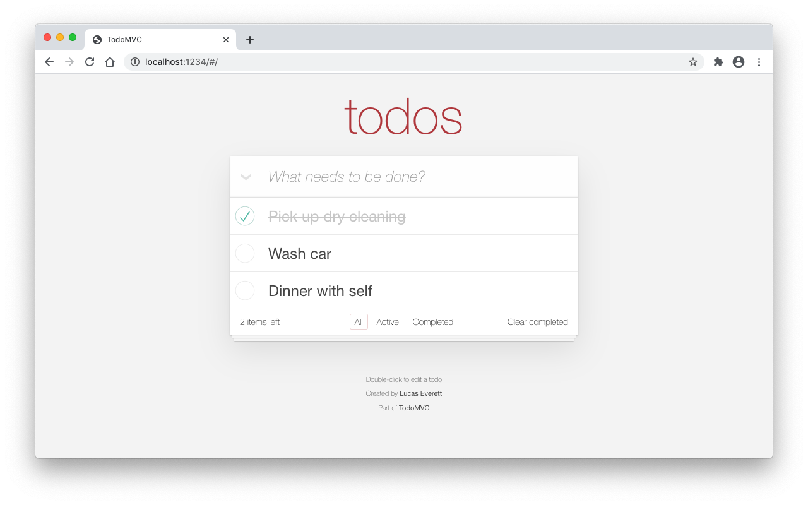

<div style="text-align:center"></div>

# TodoMVC (React)

This is a port of [TodoMVC](http://todomvc.com/) using [React](https://reactjs.org/). All functionality from TodoMVC has been implemented. Additionally, an event listener for localStorage has been added so that todos are updated across multiple open browser tabs.

## Live Demo

https://code.lucaseverett.dev/todomvc-react/

## Getting Started

Clone this repo:

```sh
git clone https://github.com/lucaseverett/todomvc-react.git
```

Install NPM dependencies:

```sh
npm install
```

Start dev server:

```sh
npm start
```
